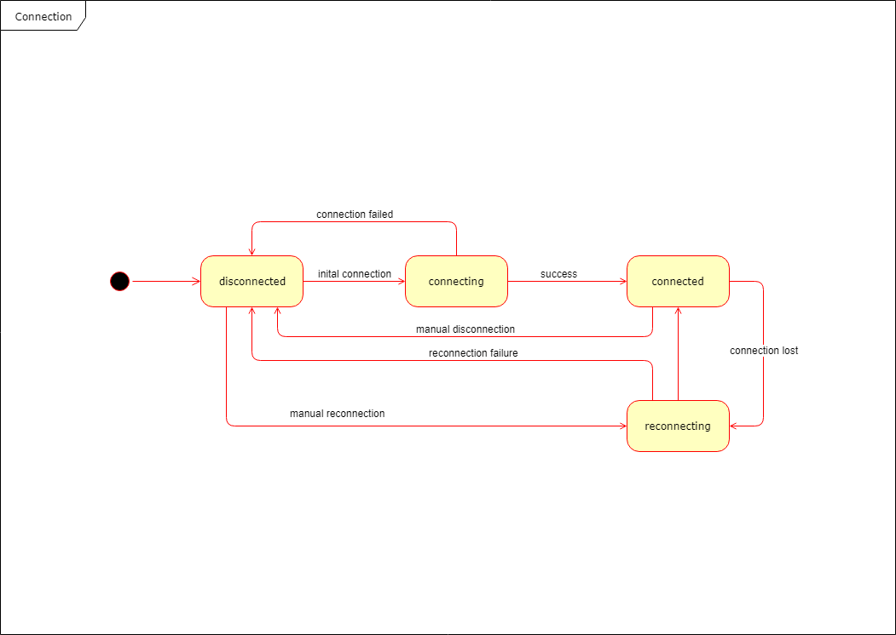

# kano-devices-sdk

Allows the detection and comunication with Kano devices.

## Class Diagram


## Platform independance

This SDK aims to be platform independant as it doesn't implement any Bluetooth, Wi-FI or serial communication.
Instead it provides classes expecting a mixin for a BLEDevice/SerialDevice/WiFIDevice to be provided.

## Platform support

Some platforms are already supported and available in the `platforms` directory.

### Nodejs

Bluetooth communication is supported in a nodejs environment using the modules `noble` or `noble-uwp`. These modules will need to be installed in your project.

### Cordova

Bluetooth communication is supported in a cordova environment using the plugin cordova-plugin-bluetoothle.

## Example


```js
import Devices from '../kano-devices/sdk/kano-devices-sdk.js';
// Pltform specific bluetooth watcher and device mixin
import Watcher from './ble-watcher.js';
import BLEDeviceMixin from './ble-device.js';

const DevicesManager = new Devices({
    bluetooth: {
        watcher: new Watcher(),
        deviceMixin: BLEDeviceMixin,
    },
});

export default DevicesManager;

```

Example of a mixin for the BLEDevice:

```js
// Return a function that will receive the Device class. It needs to extends it, implement the bluetooth methods and return the BLEDevice class
const BLEDeviceMixin = (Device) => {
    class BLEDevice extends Device {
        // Will receive the device object the watcher found
        constructor(device) {
            super();
            this.type = 'ble-device';
            // Do something with the device object
        }
        // Implement here the methods
    }
    return BLEDevice;
};

export default BLEDeviceMixin;

```

## Connection lifecycle

A BLEDevice must track the state of its connection following this State Machine Diagram:



## Adapters

If required to run in a brwoser environment, you can use the `kano-hardware-communication-lib` to provide a bus communication between this SDK and a browser. This can be done use the bus adapter.

```js

import BusAdapter from './node_modules/kano-devices-sdk/bus-adapters/bus-adapter.js';
import { Devices } from './node_modules/kano-devices-sdk/kano-devices-sdk.js';

// Dummy bus
// Give this bus to both the sdk adapter and the device manager
const bus = new EventEmitter();

```

In the main process of an electron application:
```js
const { ipcMain, BrowserWindow } = require('electron');

const window = new BrowserWindow();

// Electron using IPC
// Give this bus to the sdk adapter
const bus = new ElectronIpcBus(ipcMain, window);

```

In the renderer process of an electron application:
```js
const { ipcRenderer } = require('electron');

// Electron using IPC from the renderer
// Give this bus to the device manager
const bus = new ElectronIpcBusRenderer(ipcRenderer);

```

### Possible future applications:

 - Write a websocket adapter
